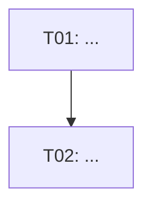

# Create a Structured Project Plan

Generate a complete, production-ready project plan document for the following goal.

**Goal**: ${input:goal:e.g. Build a REST API service for user authentication}
**Deadline**: ${input:deadline:e.g. 2026-06-30}

## Instructions

Follow all six phases of the Planner agent workflow:

1. **Understand the goal**: Restate the goal as an objective, success criteria, and constraints derived from the deadline and any context available in the workspace.

2. **Decompose tasks**: Apply the [task-decomposition skill](../skills/task-decomposition/SKILL.md). Identify all major deliverables, then break each into SMART atomic tasks with ID, owner, duration, and status. Every task must start with an action verb.

3. **Map dependencies**: Apply the [dependency-mapping skill](../skills/dependency-mapping/SKILL.md). Identify predecessor relationships (hard blockers only), render a Mermaid `flowchart TD` diagram, detect any cycles and resolve them, then compute and annotate the critical path.

4. **Assess risks**: Apply the [risk-assessment skill](../skills/risk-assessment/SKILL.md). Brainstorm at least 5 risks across the five categories (Schedule, Technical, Resource, External, Quality). Score each by probability × impact to derive severity. Write a mitigation strategy for every Medium and High severity risk.

5. **Define milestones**: Group tasks into logical delivery checkpoints. Assign at least 2 milestone dates that fall on or before `${input:deadline:e.g. 2026-06-30}`. Each milestone must list the task IDs that must be `done` for the milestone to be reached.

6. **Compose and save the plan**: Write the complete document conforming to the [plan-output-format instructions](../instructions/plan-output-format.instructions.md), then save it as `plans/<goal-slug>-plan.md` where `<goal-slug>` is a lowercase, hyphen-separated version of the goal title.

## Output Format

The saved file must have this exact structure:

```markdown
---
title: <Plan Title>
date: <today in YYYY-MM-DD>
status: not-started
owner: Project Lead
deadline: <deadline>
---

# <Plan Title>

## Goal

<Two to three sentences: what must be achieved, measurable success criteria, and key constraints.>

## Tasks

| ID  | Task | Owner | Duration | Status | Depends On |
|-----|------|-------|----------|--------|------------|
| T01 | ... | ... | ... | not-started | — |

## Dependencies



**Critical Path**: T01 → T02 → ...

## Milestones

| Milestone | Target Date | Tasks Included |
|-----------|-------------|----------------|
| M1        | YYYY-MM-DD  | T01, T02       |

## Risks

| ID  | Category | Risk Description | Probability | Impact | Severity | Mitigation | Owner |
|-----|----------|-----------------|-------------|--------|----------|------------|-------|
| R01 | ...      | ...             | ...         | ...    | ...      | ...        | ...   |
```

## Quality Checklist

Before saving the file, verify:

- [ ] YAML front-matter has `title`, `date`, `status`, `owner`, and `deadline`.
- [ ] All five H2 sections are present in order: Goal, Tasks, Dependencies, Milestones, Risks.
- [ ] Every task has a unique ID, owner, duration estimate, status, and dependency column.
- [ ] The Mermaid diagram references only task IDs that exist in the task table.
- [ ] At least 5 risks are documented; every High-severity risk has a non-empty Mitigation cell.
- [ ] At least 2 milestones are defined with `YYYY-MM-DD` target dates on or before the deadline.
- [ ] No placeholder text, `TODO`, or `...` appears anywhere in the saved file.
- [ ] All `Status` values are `not-started` (this is a freshly created plan).
