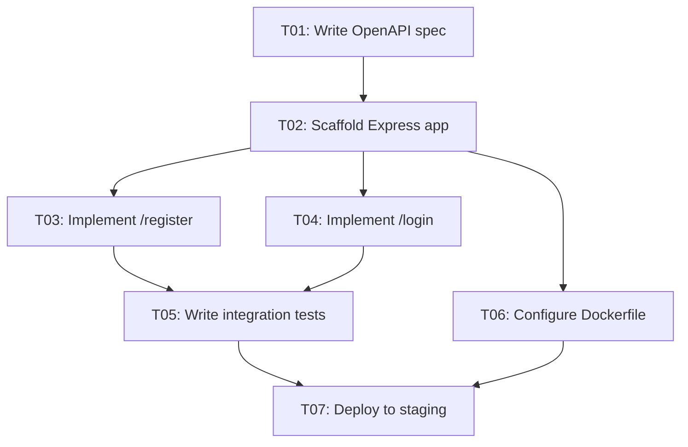
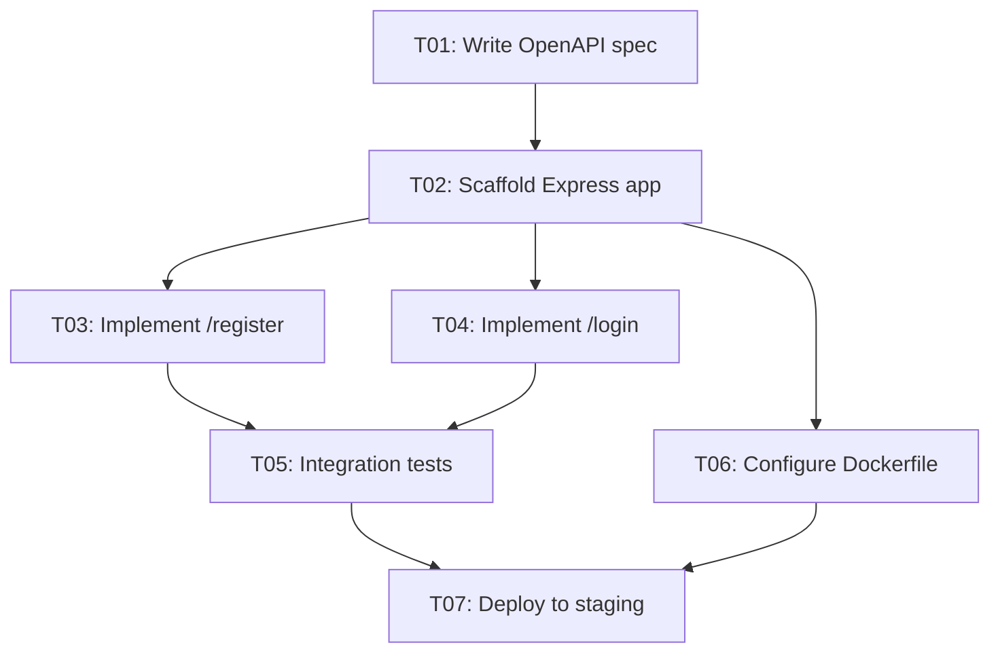

# Dependency Mapping

Dependency mapping identifies which tasks must complete before others can start,
models those relationships as a **Directed Acyclic Graph (DAG)**, and extracts
scheduling insights like the critical path. A correct dependency model prevents
blocked work, eliminates false parallelism assumptions, and enables accurate
milestone scheduling.

## When to Use This Skill

- A task list exists and needs to be ordered for execution.
- A plan document has tasks but no explicit `Depends On` column or diagram.
- Two tasks appear to be in conflict or creating a bottleneck.
- You need to identify which tasks are on the critical path.
- You need to render a Mermaid dependency diagram for the `## Dependencies` section.
- A new task is being added and its position in the dependency chain must be verified.

## Prerequisites

- A complete task list with IDs assigned (output of the task-decomposition skill, or existing plan).
- Understanding of which tasks produce outputs that subsequent tasks consume.
- No dependency cycles must exist before the plan is finalized — this skill includes cycle detection.

## Step-by-Step Workflow

### Step 1: List All Tasks with IDs

Start with an enumerated list of all tasks from the plan. If IDs are not yet assigned, assign them now (T01, T02, ...).

**Example starting list:**

```
T01 Write OpenAPI spec
T02 Scaffold Express app
T03 Implement /register endpoint
T04 Implement /login endpoint
T05 Write integration tests
T06 Configure Dockerfile
T07 Deploy to staging
```

### Step 2: Identify Predecessor Relationships

For each task, ask: **"What must be fully complete before this task can start?"**

Fill in a predecessor table — only hard blockers, never preferences:

| Task | Predecessors | Reason |
|------|--------------|--------|
| T01  | —            | No dependency; can start immediately |
| T02  | T01          | Scaffold needs the API spec to define folder structure |
| T03  | T02          | Endpoint implementation requires the scaffolded app |
| T04  | T02          | Same: needs scaffold |
| T05  | T03, T04     | Tests require both endpoints to be implemented |
| T06  | T02          | Dockerfile only needs the app scaffold |
| T07  | T05, T06     | Deployment requires passing tests and a working image |

**Rules:**
- A predecessor is a **hard blocker** — if the predecessor is not done, this task cannot start.
- Do NOT add "nice to have" predecessors.
- If two tasks are truly independent, do NOT connect them — leave them as parallel work.

### Step 3: Render the Dependency Graph as a Mermaid Diagram

Translate the predecessor table into a `flowchart TD` Mermaid diagram. Each edge `A --> B` means "A must complete before B starts."

````markdown

````

**Node label format**: `ID["ID: Short task name"]`
For blocked tasks: append `:::blocked` and add `classDef blocked fill:#f55,color:#fff` at the top of the diagram block.

### Step 4: Detect and Resolve Cycles

A cycle (A → B → C → A) makes the plan unexecutable. To detect cycles:

1. Identify all root nodes (tasks with no predecessors).
2. Perform a depth-first traversal following `-->` edges.
3. Maintain a "current path" stack. If you reach a node already in the current path, a cycle exists — record the cycle.

**Common cycle causes and fixes:**

| Cause | Example | Fix |
|-------|---------|-----|
| Mutual dependency | T03 → T05 and T05 → T03 | Extract the artifact T05 actually needs from T03 into a new sub-task T03a |
| Circular review loop | T07 → T08 (review) → T07 (revise) | Break into separate phases: T07 draft, T08 review, T09 revision |
| Incorrectly modeled dependency | T02 listed as needing T06 result | Re-examine: does scaffold truly need Dockerfile? Usually no — remove edge |

### Step 5: Compute the Critical Path

The **critical path** is the longest sequence of dependent tasks from start to finish. Any delay on this path delays the entire plan.

**Algorithm (Forward Pass):**

1. For each task, compute **Earliest Start (ES)**:
   - Root tasks: ES = 0.
   - Others: ES = max(ES + Duration) across all direct predecessors.
2. **Earliest Finish (EF)** = ES + Duration.
3. **Backward Pass** — Latest Finish (LF): work backwards from the deadline.
4. **Slack** = LF − EF. Tasks with Slack = 0 are on the critical path.

**Example critical path for the REST API plan:**

```
T01 (4h) → T02 (2h) → T03 (4h) → T05 (3h) → T07 (2h)
Critical path total: 15h
```

T04 (1h + 4h = 5h path) has 5h slack because T05 waits for T03 (the longer sibling).
T06 (3h) also has slack — T05 gates T07, not T06 alone.

### Step 6: Update the Plan Document

1. Fill the `Depends On` column in the task table with predecessor IDs (comma-separated).
2. Insert the completed Mermaid diagram in the `## Dependencies` section of the plan.
3. Add a critical path annotation below the diagram:

```markdown
**Critical Path**: T01 → T02 → T03 → T05 → T07 (15h total)
```

## Examples

### Good Pattern — Minimal, Accurate DAG



This graph is correct: no cycles, edges are strict hard blockers, parallel work (T03, T04, T06) is explicitly captured.

### Bad Pattern — Over-constrained Sequential Graph

```
T01 → T02 → T03 → T04 → T05 → T06 → T07
```

Problems:
- T03 and T04 do not actually depend on each other and can run in parallel.
- T06 does not need T03 or T04 — it only needs T02.
- Fully sequential plan approximately doubles the delivery time vs. the correct model.

**Fix**: Only add edges where there is a true hard data dependency. Independent tasks with no shared artifact can start simultaneously.

## Troubleshooting

| Symptom | Cause | Fix |
|---------|-------|-----|
| Mermaid diagram does not render | Incorrect syntax — missing brackets or wrong arrow type | Use `-->` for edges, wrap node labels in `["text"]` |
| Cycle detected in graph | Mutual dependency or incorrectly modeled relationship | Re-examine both directions; break with a sub-task that supplies only the needed artifact |
| All tasks appear sequential | Over-constrained from caution | Remove each edge and ask: "Can this task actually start without waiting?" |
| Critical path changes unexpectedly | Duration estimates were updated | Recompute ES/LF from scratch whenever any duration changes |
| `Depends On` IDs don't match task table | Tasks were renumbered after editing | Update both the task table and `Depends On` column together; use find-replace for IDs |

## References

- Critical Path Method (CPM): PMI PMBOK Guide, 7th Edition, Section 6.6 — Schedule Network Analysis.
- Directed Acyclic Graph algorithms: Cormen et al., *Introduction to Algorithms*, 4th ed., Chapter 22.
- Mermaid flowchart syntax reference: https://mermaid.js.org/syntax/flowchart.html
