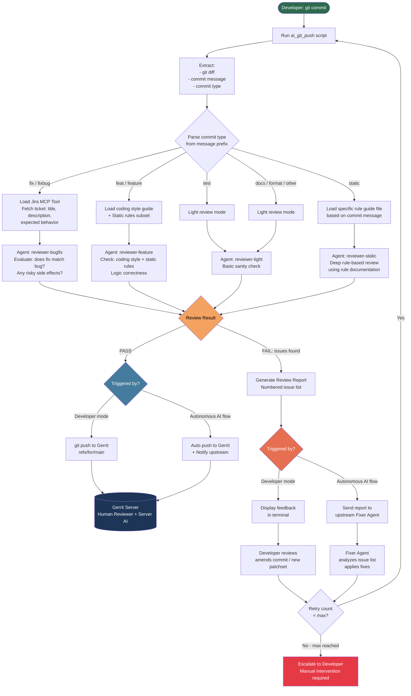

# Local AI Code Review Before Push — Design Document

## 1. Đánh Giá Giải Pháp

### 1.1 Ý tưởng tổng thể — Nhận xét

Ý tưởng **hoàn toàn khả thi và có giá trị thực tiễn cao**. Đây là pattern "Left-Shift Quality Gate" — đẩy kiểm tra sớm nhất có thể về phía developer, giảm vòng lặp feedback tốn kém (upload patchset → trigger build → chờ AI review trên server → nhận -1 → fix → repeat).

Vấn đề cốt lõi bạn đang giải quyết:
- **Tốn tài nguyên**: Mỗi patchset trigger build server
- **Vòng lặp chậm**: Nhận feedback từ Gerrit AI mất thời gian chờ
- **Nhiễu loạn workflow**: -1 vì lỗi nhỏ làm gián đoạn cả team

Giải pháp local AI review trước push là **đúng hướng**.

---

### 1.2 Đánh Giá Kỹ Thuật: GitHub Copilot CLI vs SDK

| Phương án | Khả thi? | Ưu điểm | Nhược điểm |
|---|---|---|---|
| **GitHub Copilot CLI** (`gh copilot`) | Hạn chế | Cài đơn giản, không cần code | Thiết kế cho interactive mode, output khó parse, không có flag `--non-interactive` đáng tin cậy |
| **GitHub Copilot SDK** (Python/TS, Tech Preview) | **Tốt nhất** | Programmatic, output có thể structured, tích hợp MCP, gọi custom agent | Tech Preview — API có thể thay đổi; cần setup phức tạp hơn |
| **GitHub CLI + `gh api`** (Copilot API trực tiếp) | Tốt | Stable, scriptable, output JSON | Không dùng được custom agent profiles |
| **VS Code Agent Mode** | Không phù hợp | — | Không scripted từ CLI |

**Khuyến nghị**: Dùng **GitHub Copilot CLI** như entry point cho developer mode (interactive output ra terminal), kết hợp với **GitHub Copilot SDK** cho autonomous AI flow (cần parse output có cấu trúc). Script `ai_git_push` gọi CLI, agent output bao gồm tag `[PASS]` / `[FAIL: <reason>]` để script parse.

---

### 1.3 Cách Implement Script `ai_git_push`

```bash
# ai_git_push (Linux/macOS) — pseudocode logic
#!/bin/bash

# 1. Extract commit info
DIFF=$(git diff HEAD~1 HEAD)
COMMIT_MSG=$(git log -1 --pretty=%B)
COMMIT_TYPE=$(echo "$COMMIT_MSG" | grep -oP '^[a-z]+(?=[\(:])') # feat, fix, test, etc.

# 2. Determine agent and review depth based on commit type
case "$COMMIT_TYPE" in
  fix|fixbug)   AGENT="reviewer-bugfix" ;;
  feat|feature) AGENT="reviewer-feature" ;;
  test)         AGENT="reviewer-light" ;;
  static)       AGENT="reviewer-static" ;;
  docs|format)  AGENT="reviewer-light" ;;
  *)            AGENT="reviewer-light" ;;
esac

# 3. Call Copilot CLI with selected agent
REVIEW_OUTPUT=$(gh copilot review --agent "$AGENT" --diff "$DIFF" --message "$COMMIT_MSG")

# 4. Parse result
if echo "$REVIEW_OUTPUT" | grep -q "\[PASS\]"; then
    git push origin HEAD:refs/for/main
else
    echo "=== AI Review Issues Found ==="
    echo "$REVIEW_OUTPUT"
    exit 1  # Block push, return feedback
fi
```

**Lưu ý thực tế**: `gh copilot review` là ví dụ conceptual — CLI hiện tại cần wrap qua `gh copilot suggest` hoặc SDK. Cần thiết kế agent output protocol (ví dụ: agent luôn kết thúc bằng `[PASS]` hoặc `[FAIL: <issues>]`) để script parse được.

---

### 1.4 Đề Xuất Điều Chỉnh Thiết Kế

**Vấn đề cần xử lý thêm:**

1. **Staging area vs committed**: Script nên review `git diff --staged` (trước commit) hoặc `HEAD~1` (sau commit)? — Recommend: **trước commit** để còn sửa dễ.
2. **Diff size limit**: Diff quá lớn (>2000 lines) có thể vượt context window của model — cần truncate hoặc chunk.
3. **PASS/FAIL protocol**: Agent reviewer **phải** output theo format định sẵn để script parse. Encode vào agent profile: "Always end your response with `[PASS]` if no issues, or `[FAIL]` followed by a numbered list of issues."
4. **Jira MCP dependency**: Nếu không có Jira MCP server configured, fixbug flow sẽ fail. Cần fallback: nếu không lấy được ticket, reviewer chỉ review code thuần, không đánh giá solution fit.
5. **Retry limit**: Autonomous flow cần có max iteration (ví dụ: 3 lần) để tránh infinite loop khi agent và fixer không agree.
6. **Commit type parsing**: Dựa vào conventional commits (`fix:`, `feat:`, `test:`, etc.) là best practice — nên enforce convention này trong `copilot-instructions.md`.

---

## 2. Mermaid Flow Diagram



---

## 3. Agent Profiles Cần Tạo

### `reviewer-bugfix.md`
```markdown
---
name: reviewer-bugfix
description: Reviews bug fix commits by cross-referencing with Jira ticket details
tools:
  - codebase
  - jira  # requires Jira MCP server
---

You are a code reviewer specializing in bug fix validation.

## Review process
1. Extract the Jira ticket ID from the commit message (format: PROJECT-XXXX)
2. Use the Jira MCP tool to fetch: ticket title, description, acceptance criteria
3. Analyze the git diff
4. Evaluate:
   - Does the fix address the root cause described in the ticket?
   - Are there edge cases not covered?
   - Could this fix introduce regressions?
   - Is there adequate test coverage for the fix?

## Output format
Always end with exactly one of:
- `[PASS]` — if no significant issues
- `[FAIL]` followed by a numbered list of specific, actionable issues
```

### `reviewer-feature.md`
```markdown
---
name: reviewer-feature
description: Reviews feature commits with coding style and static rule checks
tools:
  - codebase
  - editFiles
---

## Review steps
1. Check naming conventions and coding style (see .github/instructions/coding-style.instructions.md)
2. Review logic correctness and error handling
3. Check for common static issues: null dereference, memory leaks, uninitialized vars
4. Verify public APIs have documentation comments

## Output format
Always end with `[PASS]` or `[FAIL]` + numbered issue list.
```

### `reviewer-static.md`
```markdown
---
name: reviewer-static
description: Reviews static analysis fix commits using rule documentation
tools:
  - codebase
---

## Review steps
1. Parse the commit message to identify the specific rule(s) being fixed (e.g., MISRA C Rule 14.4)
2. Load the rule documentation from `.github/skills/static-rules/<RULE-ID>/SKILL.md`
3. Verify each changed line correctly addresses the rule
4. Check no new violations were introduced in surrounding code

## Output format
Always end with `[PASS]` or `[FAIL]` + numbered issue list.
```

---

## 4. Cấu Trúc File Cần Tạo

```
.github/
├── agents/
│   ├── reviewer-bugfix.md
│   ├── reviewer-feature.md
│   ├── reviewer-static.md
│   └── reviewer-light.md
├── skills/
│   └── static-rules/
│       ├── MISRA-C-14-4/
│       │   └── SKILL.md
│       └── ...
└── instructions/
    └── coding-style.instructions.md

scripts/
├── ai_git_push          # Linux/macOS
└── ai_git_push.bat      # Windows

agent-output/
└── review-logs/         # Audit trail của mọi review
```
